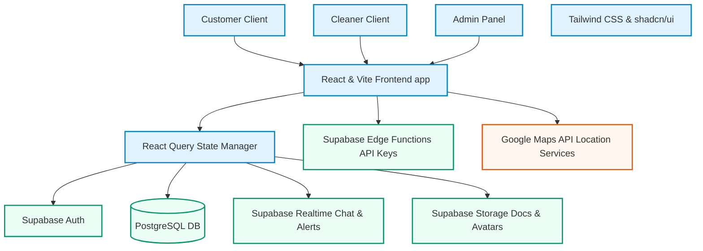

# ✨ The Cleaning Network (Clean Scene Network) ✨

[](https://vitejs.dev/)
[](https://reactjs.org/)
[](https://www.typescriptlang.org/)
[](https://supabase.com/)
[](https://tailwindcss.com/)
[](https://ui.shadcn.com/)

An advanced, feature-rich peer-to-peer cleaning marketplace connecting homeowners, renters, and commercial clients with verified local cleaning professionals. The platform streamlines finding service providers, request matching, scheduling, communication, invoicing, and manual/wallet payment settlements, backed by a robust admin configuration suite.

---

## 🗺️ System Architecture



---

## 🌟 Key Features by User Portal

### 🏠 Client Portal
* **Live Cleaner Discovery:** Perform custom searches filtered by service categories, locations (using Google Maps autocomplete), rating averages, hourly pricing, and availability.
* **Smart Quote Requests:** Post public cleaning jobs specifying room specifics, budget ranges, and urgency. Alternatively, request direct quotes from individual cleaners.
* **Instant Booking System:** Book cleaning service packages directly with automated duration estimation and cost calculations.
* **Address Book & Profile Vault:** Seamlessly manage multiple service addresses (e.g., home, office, vacation rentals) and payment preferences.
* **Integrated Payments & Wallets:** Deposit funds into a personal wallet balance, review service invoices, and pay securely using manual gateways or direct credits.
* **Realtime Chat & Notifications:** Communicate with service providers with instant push alerts, unread message badges, and presence updates.

### 🧹 Cleaner Partner Portal
* **Professional Showcases:** Custom public profiles complete with service badges, bio narratives, pricing structure, service areas, experience stats, and gallery media.
* **Smart Schedule Coordinator:** Manage available hours, accept direct booking requests, or suggest alternative slot reschedules.
* **Quote Bid Center:** Browse customer job postings matching service areas and place bids specifying custom estimated prices and cover messages.
* **Verification & Trust Vault:** Upload licensing, background checks, and liability insurance directly to administrators for verification badges.
* **Earnings & Wallet Portal:** Track active earnings balances, review historical payouts, request manual withdrawals, and verify invoices.
* **Sponsorship Boosts:** Apply for premium sponsored listings and bid for the featured **Cleaner of the Week** spotlight to increase platform visibility.

### ⚙️ Admin Control Tower
* **Platform Operations:** Adjust platform commission rates, system min/max rates, advance booking limits, and registration approval behaviors.
* **Cleaner Credentials Verification:** Review and verify uploaded cleaner documentation (licensing/insurance) with status updates.
* **Payment Gateways & Audits:** Oversee manual top-up requests, subscription verifications, invoice compliance, and payout logs.
* **Sponsorship & Spotlight Coordinator:** Select/activate the "Cleaner of the Week" and manage premium priority sponsored bids.
* **Platform-Wide Notification Dispatcher:** Broadcast critical updates, banner notices, and custom warnings directly to all online clients.
* **Theme Management Engine:** Configure and adjust global design system configurations (dark mode presets, fonts, spacing elements).

---

## 🛠️ Technology Stack

| Technology | Purpose | Description |
| :--- | :--- | :--- |
| **Vite + React 18** | Frontend Engine | Fast, optimized hot-module-reloading SPA with code-splitting. |
| **TypeScript** | Quality Assurance | Strict type-safety matching the PostgreSQL schema definitions. |
| **Tailwind CSS** | Premium Styling | Vibrant colors, dynamic animations, and dark mode configuration. |
| **shadcn/ui** | Component Library | Accessible Radix UI components (Modals, Dialogs, Selects, Dropdowns). |
| **Supabase** | Backend Suite | Auth handler, Postgres relational database, Storage bucket, and Realtime sync. |
| **Tanstack Query** | Caching & Syncing | Handles network queries, caching policies, and optimistic UI updates. |
| **GSAP & Framer Motion** | Micro-Animations | Smooth scroll-based reveals, card highlights, and dashboard page transitions. |
| **Recharts** | Analytics Charts | Beautiful visualizations of cleaner earnings, profile views, and platform metrics. |

---

## 🗄️ Database Schema Directory

The database is built on **Supabase (PostgreSQL)**. Key relational tables include:

```
├── profiles                       # Core user identity data (linked to Supabase Auth)
├── cleaner_profiles               # Cleaner portfolios, business names, ratings, and rates
├── addresses                      # Customer service location registry
├── bookings                       # Service reservation records and schedules
├── service_listings               # Special service packages advertised by cleaners
├── jobs                           # Customer quote invitations / job postings
├── job_applications               # Offers and price bids made by Cleaners on Jobs
├── quote_requests                 # Inquiries for custom price estimates
├── quote_responses                # Cleaner bids responding to Quote Requests
├── conversations                  # Chat rooms connecting Clients and Cleaners
├── messages                       # Text chat messages with attachments
├── invoices                       # Financial service statements generated on job completion
├── payment_records                # Financial transaction receipts and status tracker
├── provider_verification_docs     # Cleaner security/licensing documentation uploads
├── wallets                        # Virtual credit vaults for both Cleaners and Clients
├── wallet_transactions            # Topups, debits, credits, and withdrawal events
├── cleaner_of_the_week            # Administrative spotlight highlights
└── platform_settings              # Global marketplace configuration parameters
```

---

## 📁 Directory Structure

```
├── supabase/                      # Supabase database schemas, migrations & edge functions
├── public/                        # Static assets (favicons, manifest templates, animations)
├── src/
│   ├── assets/                    # Image assets, logo banners, and graphical presets
│   ├── components/                # Modular, reusable UI building blocks
│   │   ├── admin-dashboard/       # Admin interface sub-panels
│   │   ├── cleaner-dashboard/     # Cleaner interface controls
│   │   ├── dashboard/             # Customer interface elements
│   │   ├── chat/                  # Realtime message bubbles and inputs
│   │   ├── maps/                  # Google Maps renderers and autocompletes
│   │   └── ui/                    # Custom, accessible shadcn/ui primitives
│   ├── contexts/                  # React state provider contexts (AuthContext.tsx)
│   ├── hooks/                     # Custom hooks (Queries, realtime, geolocation, wallets)
│   ├── integrations/
│   │   └── supabase/              # Supabase Client initializers and schema TypeScript types
│   ├── lib/                       # Utility helpers (formatting date-fns, Tailwind merger, classnames)
│   ├── pages/                     # Main view routers and dashboards
│   ├── types/                     # Shared TypeScript declarations
│   ├── index.css                  # CSS design variables and custom base components
│   ├── App.tsx                    # Main App router and layout wrapper
│   └── main.tsx                   # SPA Entrypoint
└── package.json                   # Project packages, scripts, and runtime engines
```

---

## ⚙️ Local Development Setup

To run this project locally, ensure you have **Node.js (v18+)** and **npm** installed.

### 1. Clone the repository
```sh
git clone <your-repository-url>
cd clean-scene-network-main
```

### 2. Configure Environment Variables
Create a `.env` file in the root directory:
```sh
cp .env.example .env
```
Open `.env` and fill in your Supabase project credentials:
```env
VITE_SUPABASE_PROJECT_ID="your_project_id"
VITE_SUPABASE_URL="https://your_project_id.supabase.co"
VITE_SUPABASE_PUBLISHABLE_KEY="your_anon_key"
```

### 3. Install Dependencies
```sh
npm install
```

### 4. Boot up the Local Dev Server
```sh
npm run dev
```
Open your browser to [http://localhost:8080](http://localhost:8080) (or the port shown in your terminal).

---

## 🚀 Build & Production Deployment

### Compile the Web App
Build a production-optimized package containing static assets, minified code, and asset split bundles:
```sh
npm run build
```

### Preview Local Production Build
```sh
npm run preview
```

---

## 📝 Coding Conventions & Architecture Guidelines
* **TypeScript Types:** Import types directly from `@/integrations/supabase/types` to ensure strict synchronization with database columns.
* **Component Styling:** Use tailwind classes following the standard box-model order. Do not write inline styles.
* **Data Fetching:** Do not instantiate random `fetch` or custom raw promises. Always write queries/mutations using custom React Query hooks located in `src/hooks/` to benefit from standard hydration, caching, and state invalidation features.
* **Interactive Elements:** Ensure interactive components support accessibility best practices (Radix-UI compliant dialogs, focus traps, aria attributes).